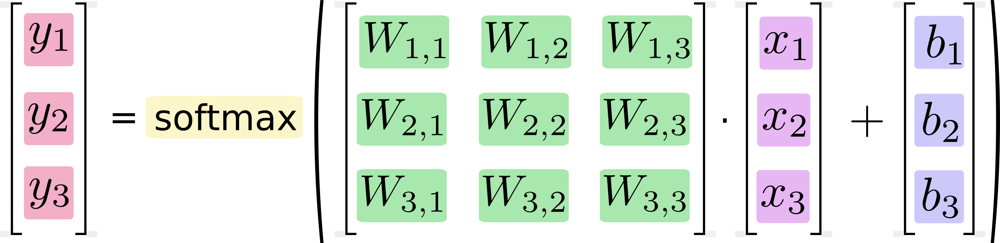

# Convolutional Neural Networks
with Keras

---

## Why CNNs?
- Image inputs cause problems for fully-connected neural networks.


+++
Smaller image (CIFAR-10):

$32\times 32\times 3 = 3072$ parameters per neuron (first layer)

Larger image (most stuff):

$200\times 200\times 3 = 120,000$ parameters!


+++

- computationally expensive
- prone to overfitting

---

## CNN Inspiration: the Visual Cortex
- Regions of cells are sensitive to specific _regions_ of the visual field
- neurons in these regions only fire in presence of specific _features_: vertical, horizontal, or diagonal edges, etc.

---

## CNN Layers
- convolutional, activation, pooling, dense

---

## Slide for each layer type and corresponding keras code
- including properties

---

## model pic showing how CNN works


+++


---

## car pic example

---

### PROBLEM: MNIST Digit Classification

### Image Input for SoftMax


---

### Implementation

---

## Training

---

## Hyperparameter Optimization

---

## Running it all: Google CoLab

---

### Softmax Implementation


+++

### equation form


+++

### matrix form



+++

### defining the model

```python
x = tf.placeholder(tf.float32, [None, 784])
W = tf.Variable(tf.zeros([784, 10]))
b = tf.Variable(tf.zeros([10]))
y = tf.nn.softmax(tf.matmul(x, W) + b)
```

---

## MNIST with SoftMax


+++?code=mnist_softmax.py&lang=python

@[16-20](tutorial source)
@[21-27](various imports)
@[28-29](load MNIST data)
@[30](load TensorFlow API)
@[32](FLAGS)
@[35-37](import the (one-hot encoded) MNIST data)
@[40-42](create variables, weights, and biases)
@[43](matrix multiplication)
@[46](output layer (predicted probabilities))
@[57-58](define the loss function (measurement of incorrectness))
@[59](define how we want to reduce loss (incorrectness) over time (stochastic gradient descent))
@[61-62](start a session in TensorFlow)
@[64-66](train network using above parameters on 10 sets of 100 images)
@[69-71](check accuracy of predictions)
@[74-79](run session)

---

## Running It
- let's go to the terminal!

---

## Problem

- rotated characters can be hard to recognize


+++

### Example MNIST  


+++
### Translated


+++
### Rotated


---

## Convolutional Neural Networks (CNNs)
- assume image inputs
- 3D layers: width, height, depth
- neurons in a layer only connected to small _regions_ of previous layer, instead of fully-connected
- unique layer types

---

## CNN Unique Layers
- convolutional: slide filters across image --> activation maps of image responses to filters ([example](http://cs231n.github.io/convolutional-networks/))
  - conv layers learn a set of filters appropriate to the problem
- ReLu (Rectified Linear units): often follow conv layers. Adds nonlinearity to the net (e.g. changing all negative activations to 0)


+++

- pooling: "downsample the data": reduce spatial size of representation to cut down computation and number of parameters (also controls overfitting)
- dense (fully-connected): often just for classification

---

## Typical CNN Structure

1. convolutional modules (conv + pooling) for _feature extraction_
2. 1+ dense layer(s) for classification at end

---

## MNIST with CNN


+++?code=mnist_cnn.py&lang=python

@[38-43](example conv layer with appended ReLu activation)
@[49](example pool layer (note simplicity of implementation))
@[87](output layer shape(softmax classification))
@[94](softmax classification)

---

# Additional Info

---

## One-Hot Encoding

- one-hot vectors are 0 in all dimensions but one (which is 1).
- avoids assuming order between categories, as integer encoding (1, 2, 3) does.
- e.x. [1,0,0], [0,1,0], [0,0,1] vs 0, 1, 2

---

## SoftMax (normalized exp(x))

- gives a list of values between 0 and 1 that sum to 1
  - a natural choice for probability
- exponentiates inputs then normalizes for pdf
- [more detailed exploration](http://neuralnetworksanddeeplearning.com/chap3.html#softmax)

---

## Cross-Entropy

- measures how inefficient predictions are at describing the truth
- compares predicted probability distribution to true, one-hot encoded probability vector

+++


for predicted distribution _y_, one-hot vector _y'_

---

## Backpropagation

- [detailed introduction](http://colah.github.io/posts/2015-08-Backprop/)

---

## Gradient Descent

- shifting variables small amounts in direction of reduced loss
- [mathy intro](https://en.wikipedia.org/wiki/Gradient_descent)

---

## MNIST Dimensionality

- [detailed exploration](http://colah.github.io/posts/2014-10-Visualizing-MNIST/)

---

## CNN Layers

- convolutional
- ReLu activation
- pooling
- dropout

---

## Pooling Visualization


## CNN Hyperparameters

- depth, stride, and padding (determine conv layer output volume)
- filter sizes
- number of (conv) layers

---

## CNN additional detail

- [intro, pt 1](https://adeshpande3.github.io/adeshpande3.github.io/A-Beginner%27s-Guide-To-Understanding-Convolutional-Neural-Networks/)
- [intro, pt 2](https://adeshpande3.github.io/adeshpande3.github.io/A-Beginner's-Guide-To-Understanding-Convolutional-Neural-Networks-Part-2/)
